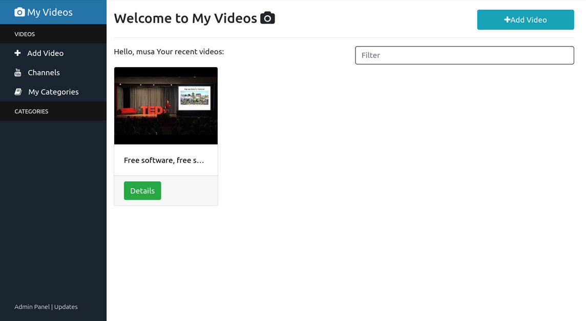
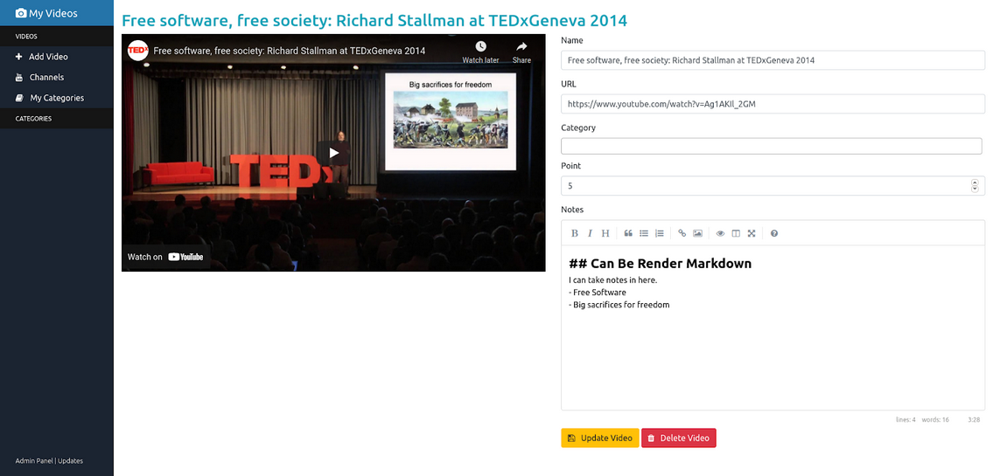
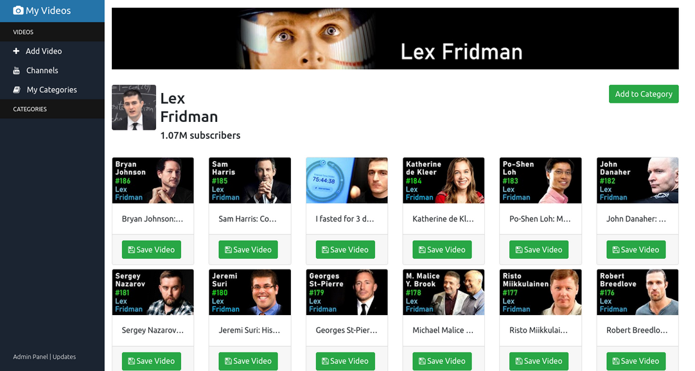
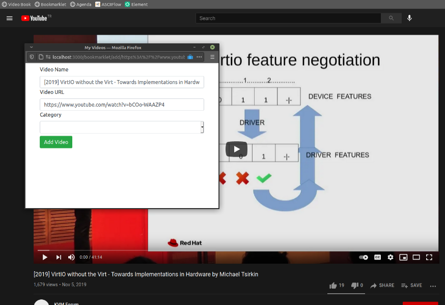

# my videos

## screenshots



Welcome Page



Video details



Follow channels inside myvideos


## dev
- create `default.js` under `db` folder, template should be like:

```js
module.exports = {
   
    db: {
      user: "mysql_user_name",
      password: "mysql_user_password"
    },

};
```

### running
- you can run node with nodemon. to install `npm install -g nodemon`, after just type `nodemon` to run.


## bookmarklet
- videos can be saved with bookmarklet.

```
javascript:javascript:(function(){var%20url%20=%20location.href;var%20description=document.getSelection()||'';var%20title%20=%20document.title%20||%20url;window.open('http://localhost:3000/bookmarklet/add/' + encodeURIComponent(url)+'/'+encodeURIComponent(title),'_blank','menubar=no,height=450,width=600,toolbar=no,scrollbars=yes,status=no,dialog=1');})();
```

